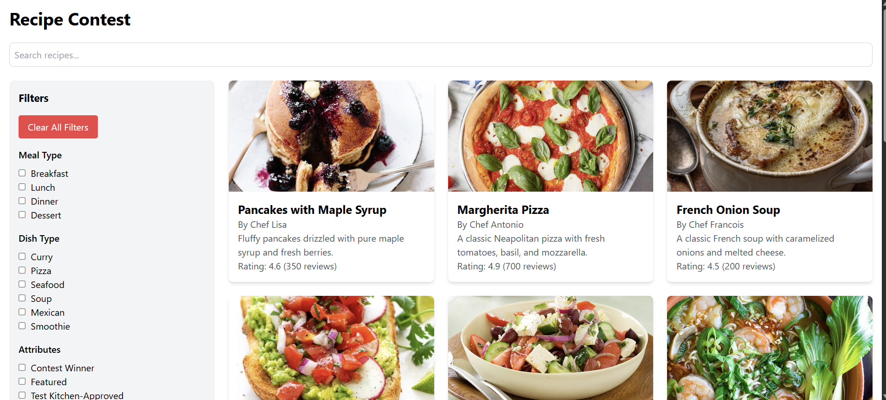

# Recipe Contest App

Welcome to the **Recipe Contest App**! This is a fully responsive web application built with **React.js** and **Tailwind CSS**. It allows users to browse, search, sort, and filter recipes for an online recipe contest.

## Features

- **Search Recipes**: Search by recipe name, chef name, or description.
- **Sort Recipes**: Sort by upload date (newest/oldest) or average rating (highest/lowest).
- **Filter Recipes**: Filter by meal type, dish type, and attributes (e.g., contest winner, featured, test kitchen-approved).
- **Responsive Design**: Works seamlessly on desktop, tablet, and mobile devices.
- **Lazy Loading**: Images are lazy-loaded for better performance.
- **Smooth Animations**: Fade-in animations for recipe cards.

---

## Live Demo

Check out the live demo of the app:  
[Recipe Contest App on Vercel](https://recipe-contest-app-psi.vercel.app/)  

---

## Screenshots

  


---

## Technologies Used

- **React.js**: Frontend library for building user interfaces.
- **Tailwind CSS**: Utility-first CSS framework for styling.
- **JavaScript**: For implementing search, sorting, and filtering logic.
- **Vercel**: For deployment.

---

## Setup Instructions

Follow these steps to set up the project locally:

### 1. Clone the Repository

```bash
git clone https://github.com/your-username/recipe-contest-app.git
cd recipe-contest-app
```
